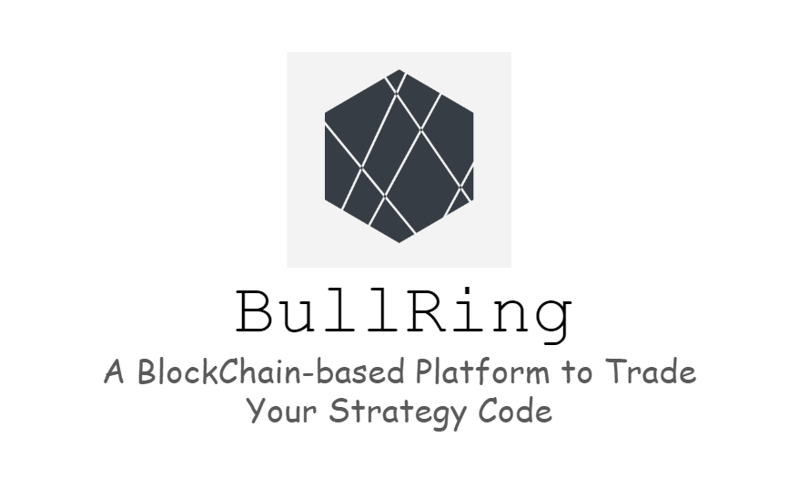
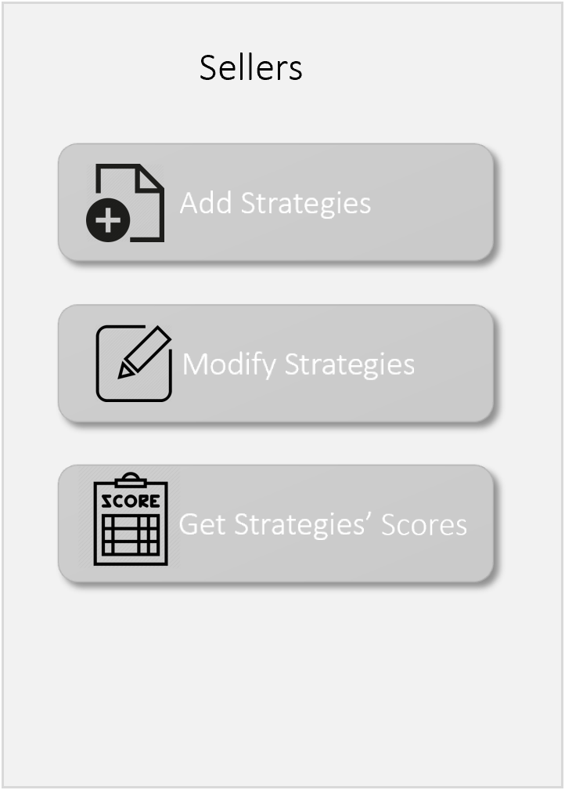
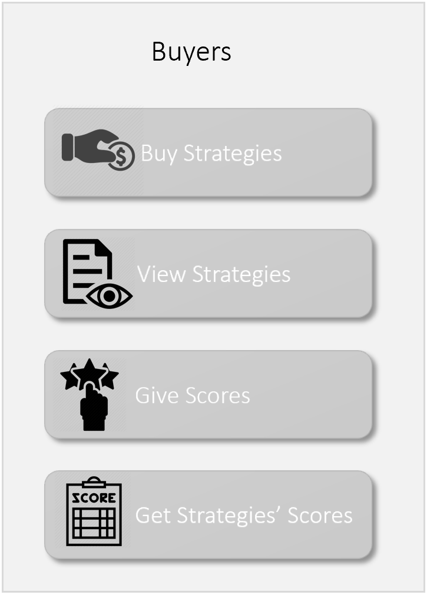

# BullRing -- BlockChain-based Investment Trading Platform
#MSBD6000D BlockChain In-Class Project

BullRing is a BlockChiain-based platform to trade investment strategies with Ethers. 

## Our Motivations
Nowadays, quantitative finance platform booms in Chinese market. Even though they provides good services in connecting strategy sellers and buyers,
It is still unsafe for both kinds of users to expose their private information to the internet and platform owners. In addition, the majority of platforms
are centralized and thus this condition can not guarantee that platform owners supply the genuine and original strategies and 
strategies' scores to both sellers and buyers. In order to solve those problems, we establish a blockchain-based strategy trading platform to
solve those problems.

## BullRing's Advantages
- Information Security
- Code Visbleness
- Swarm Intelligent Score System

## Functionalities of BullRing
<table>
    <tr>
        <td></td>
        <td></td>
    </tr>
</table>

## Get Started on BullRing
The Address of Our Deployed Smart Contact: **0xccEF227CF000B88bEc694695171ff051fBbF3975** 
[[See our Contract]](https://ropsten.etherscan.io/address/0xccef227cf000b88bec694695171ff051fbbf3975)

